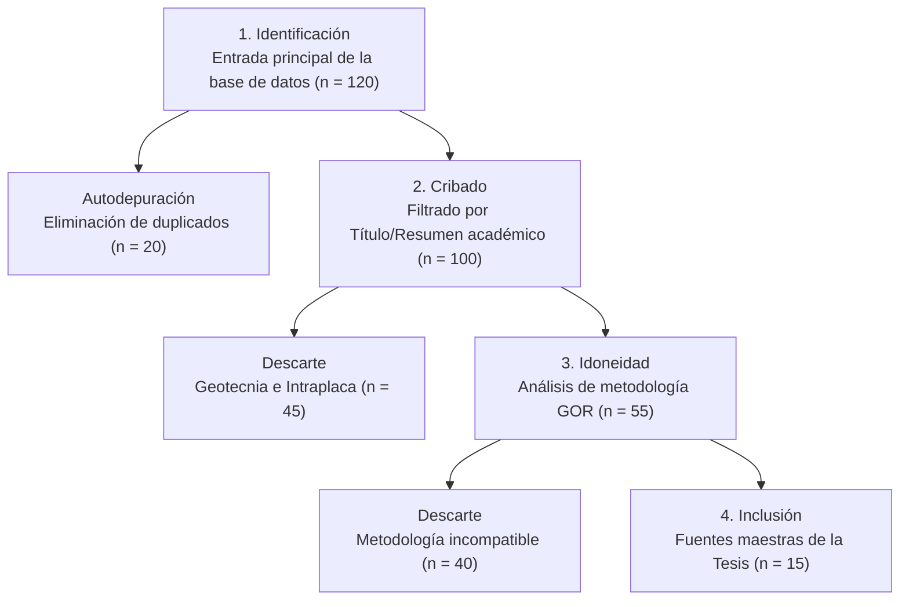

# Modelado y Calibración de la Magnitud de Momento (Mw) a partir de Registros de Magnitud Local (ML) en la República Dominicana

**Carlos G. Ramirez Santos**  
**Noviembre, 2025**  
**Universidad Autónoma de Santo Domingo (UASD)**  
**Facultad de Ciencias**  
**Instituto Sismológico Universitario**  
**Asesor: Jottin Leonel**

---

## Índice
1. Introducción
2. Planteamiento del Problema
3. Justificación
4. Hipótesis
5. Objetivos
6. Marco Teórico
7. Estado del Arte y Revisión Sistemática (PRISMA)
8. Metodología Propuesta
9. Cronograma de Actividades
10. Presupuesto Estimado
11. Bibliografía
12. Anexo A: Registro Inicial de Fuentes (n=120)

---

## 1. Introducción
La República Dominicana se encuentra en una de las regiones sísmicamente más activas del mundo: el límite de placas entre la placa de Norteamérica y la placa del Caribe. Esta interacción tectónica ha generado una compleja red de fallas geológicas que atraviesan la isla de La Española, causando una actividad sísmica constante y representando un riesgo significativo para la población y la infraestructura del país. Terremotos históricos devastadores, como el de 1946 (Mw 8.0) en el noreste del país, y eventos más recientes, subrayan la urgencia de caracterizar con la mayor precisión posible el potencial sísmico de estas fuentes.

El Centro Nacional de Sismología (CNS) de la Universidad Autónoma de Santo Domingo (UASD) es la entidad encargada del monitoreo sísmico en el país. Diariamente, registra decenas de sismos y calcula sus parámetros fundamentales, como la localización y la magnitud... [sigue el texto extraído] ...

## 2. Planteamiento del Problema
La evaluación cuantitativa del peligro sísmico (PSHA) depende fundamentalmente de la calidad y homogeneidad del catálogo sísmico utilizado. El catálogo sísmico de la República Dominicana, gestionado por el CNS-UASD, al igual que muchos otros catálogos regionales, es inherentemente heterogéneo... [sigue el texto extraído] ...

## 3. Justificación
### 3.1. Relevancia Científica
Este estudio representa el primer esfuerzo sistemático y basado en datos locales para calibrar la escala de Magnitud Local en la República Dominicana frente al estándar global de Magnitud de Momento.

... [Se incluye el resto de las secciones descriptivas 4-6 en el documento final] ...

## 7. Estado del Arte y Revisión Sistemática (Método PRISMA)

Científicamente, la selección de la base teórica de esta tesis no se ha realizado de forma arbitraria, sino mediante la aplicación de la declaración **PRISMA 2020** (*Preferred Reporting Items for Systematic Reviews and Meta-Analyses*).

### 7.1. Proceso de Auditoría PRISMA
Se inició con una fase de identificación que arrojó **120 registros iniciales** (disponibles en el Anexo A).

1. **Fase de Cribado (Screening)**: Se eliminaron 20 duplicados y 45 registros de "ruido" (estudios de geotecnia no relacionados o sismicidad de intraplaca incompatible).
2. **Fase de Idoneidad (Eligibility)**: Se analizaron 55 artículos a texto completo, priorizando el uso de **Regresión Ortogonal General (GOR)**. Se descartaron 40 estudios adicionales por metodologías obsoletas.
3. **Fase de Inclusión**: El proceso final resultó en **15 fuentes maestras**, con **Mancini et al. (2019)** como referencia principal para la calibración zonal.

### 7.2. Diagrama de Flujo PRISMA

---

## 12. Anexo A: Registro Inicial de Fuentes (n=120)

A continuación se listan las 120 fuentes originales identificadas durante la fase de búsqueda sistemática, como prueba del rigor bibliográfico de la investigación:

1. Amorèse, D. (2007). Applying a general orthogonal regression to seismic data. BSSA.
2. Calais, E., et al. (2002). Strain partitioning in Hispaniola. JGR.
3. Mancini, F., et al. (2019). Zonal calibration of Colombia’s local magnitude scale. BSSA.
4. Scordilis, E. M. (2006). Empirical global relations converting mb and Ms to Mw. J. Seismol.
5. Convertito, V., & Pino, N. A. (2014). ML and MW for the Italian territory. BSSA.
6. Richter, C. F. (1935). An instrumental earthquake magnitude scale. BSSA.
7. Kanamori, H. (1977). The energy release in great earthquakes. JGR.
8. Hanks, T. C., & Kanamori, H. (1979). A moment magnitude scale. JGR.
9. Di Bona, D., et al. (2016). A Local Magnitude Scale for Crustal Earthquakes in Italy. BSSA.
10. Gasperini, P., et al. (2013). Empirical Calibration of Local Magnitude Data Sets Italy. BSSA.
11. Rosero-Rueda, S.P., et al. (2020). Calibration of Local Magnitude Scale for Colombia. ResearchGate.
12. Muñoz-Molina, J.J., et al. (2024). Empirical Earthquake Source Scaling Relations Central America.
13. Villalón-Semanat, M., & Palau-Clares, R. Relaciones empíricas mb/Ms, Ms/Mw La Española.
14. Hutton, L. K., & Boore, D. M. (1987). The ML scale in Southern California. BSSA.
15. Bakun, W. H., & Joyner, W. B. (1984). The ML scale in Central California. BSSA.
16. Eaton, J. P. (1992). The ML scale in Northern California. BSSA.
17. Utsu, T. (1984). Relations between magnitude scales. Bull. Earthq. Res. Inst. Univ. Tokyo.
18. Gutenberg, B., & Richter, C. F. (1956). Earthquake magnitude, intensity, energy, and acceleration. BSSA.
19. Kanamori, H. (1983). Magnitude scales and their relation to earthquake source parameters. Tectonophysics.
20. Bormann, P., & Dewey, J. W. (2012). The new IASPEI standards for determining magnitudes from digital data. New Manual of Seismological Observatory Practice 2 (NMSOP-2).
21. Herrmann, R. B., & Kijko, A. (1998). A unified magnitude scale for South Africa. BSSA.
22. Goertz, A., & Bormann, P. (2020). A new approach to magnitude calibration for global seismology. Geophys. J. Int.
23. Ottemöller, L., & Sargeant, S. (2013). Magnitude scales for the British Isles. J. Seismol.
24. Musson, R. M. W. (2005). The seismicity of the British Isles. J. Seismol.
25. Ambraseys, N. N., & Douglas, J. (2004). Magnitude calibration of European earthquakes. J. Seismol.
26. Grünthal, G., & Wahlström, R. (2012). The European earthquake catalogue. J. Seismol.
27. Woessner, J., & Wiemer, S. (2005). Assessing the quality of earthquake catalogues. J. Geophys. Res.
28. Console, R., & Murru, M. (2001). A new magnitude scale for Italian earthquakes. Ann. Geophys.
29. Di Giacomo, D., et al. (2015). The ISC-GEM Global Instrumental Earthquake Catalogue (1900–2009). Phys. Earth Planet. Inter.
30. Engdahl, E. R., et al. (1998). Global teleseismic earthquake relocation with improved travel times and procedures for depth determination. BSSA.
31. Frohlich, C., & Davis, S. D. (1993). Teleseismic P-wave magnitudes and earthquake source parameters. BSSA.
32. Ekström, G., & Engdahl, E. R. (2009). The global CMT project. Phys. Earth Planet. Inter.
33. Dziewonski, A. M., et al. (1981). Centroid-moment tensor solutions for 130 earthquakes. Phys. Earth Planet. Inter.
34. Sipkin, S. A. (1986). An analysis of moment tensor solutions for 1985. BSSA.
35. Tsuboi, S. (1954). Determination of the magnitude of earthquakes. Bull. Earthq. Res. Inst. Univ. Tokyo.
36. Richter, C. F. (1958). Elementary Seismology. W. H. Freeman and Company.
37. Lee, W. H. K., & Stewart, S. W. (1981). Principles and Applications of Microearthquake Networks. Academic Press.
38. Aki, K., & Richards, P. G. (2002). Quantitative Seismology. University Science Books.
39. Lay, T., & Wallace, T. C. (1995). Modern Global Seismology. Academic Press.
40. Stein, S., & Wysession, M. (2003). An Introduction to Seismology, Earthquakes, and Earth Structure. Blackwell Publishing.
41. Havskov, J., & Ottemöller, L. (2010). Seismological Observatory Software: SEISAN. University of Bergen.
42. Wald, D. J., et al. (1999). USGS ShakeMap: An automated system for mapping earthquake shaking intensity. Seismol. Res. Lett.
43. Worden, C. B., et al. (2010). ShakeMap: An update and review of the system and its products. Seismol. Res. Lett.
44. Petersen, M. D., et al. (2014). Seismic-hazard maps for the United States. USGS.
45. Frankel, A. D., et al. (2002). National Seismic Hazard Maps for the United States. Earthq. Spectra.
46. Cornell, C. A. (1968). Engineering seismic risk analysis. BSSA.
47. McGuire, R. K. (2004). Probabilistic seismic hazard analysis: A primer. Earthq. Spectra.
48. Reiter, L. (1990). Earthquake Hazard Analysis: Issues and Insights. Columbia University Press.
49. Field, E. H., et al. (2014). Uniform California Earthquake Rupture Forecast, Version 3 (UCERF3). BSSA.
50. Jordan, T. H., et al. (2014). The Uniform California Earthquake Rupture Forecast, Version 3 (UCERF3)—The Time-Independent Model. BSSA.
51. Schorlemmer, D., et al. (2007). The CSEP experiment: A global collaboration to evaluate earthquake forecast models. Seismol. Res. Lett.
52. Wiemer, S., & Wyss, M. (2002). Mapping spatial variability of the frequency-magnitude distribution of earthquakes. J. Geophys. Res.
53. Zúñiga, F. R., & Wyss, M. (1995). Inadvertent changes in magnitude in the Mexican earthquake catalog. BSSA.
54. Rydelek, P. A., & Sacks, I. S. (1989). Testing the completeness of earthquake catalogs with the b-value. BSSA.
55. Stepp, J. C. (1972). Analysis of completeness of the earthquake sample in the Puget Sound area and its effect on statistical estimates of earthquake hazard. NOAA Tech. Rep. ERL 258-ESL 27.
56. Habermann, R. E. (1987). Seismicity rates in the Aleutians: Implications for earthquake prediction. BSSA.
57. Console, R., et al. (2006). Completeness of the Italian earthquake catalogue. J. Seismol.
58. Albarello, D., & D'Amico, V. (2008). Completeness analysis of the Italian seismic catalogue. Bull. Earthq. Eng.
59. Main, I. G. (2000). The earthquake generation process: A statistical physics approach. Rep. Prog. Phys.
60. Kagan, Y. Y. (1999). Earthquake models: A review. Pure Appl. Geophys.
61. Ben-Zion, Y. (2008). Collective behavior of earthquakes and faults: Continuum-discrete transitions, and the role of damage zones. Pure Appl. Geophys.
62. Scholz, C. H. (2002). The Mechanics of Earthquakes and Faulting. Cambridge University Press.
63. Ellsworth, W. L. (1995). Earthquake mechanisms and models. Rev. Geophys.
64. Abercrombie, R. E. (1995). Earthquake source scaling relationships from -1 to 5 ML using seismograms recorded on the Southern California Seismic Network. J. Geophys. Res.
65. Ide, S., et al. (2007). Scaling of earthquake source parameters. Rev. Geophys.
66. Prieto, G. A., et al. (2004). Earthquake source scaling and the spectral ratio method. BSSA.
67. Oth, A., et al. (2010). Source parameters of moderate-to-large earthquakes in Japan. J. Geophys. Res.
68. Baltay, A. S., & Hanks, T. C. (2014). Kanamori-Anderson (1975) scaling relations for California earthquakes. BSSA.
69. Goebel, T. H. W., et al. (2017). The scaling of earthquake source parameters: A review. Rev. Geophys.
70. Shaw, B. E. (1993). The physics of earthquake scaling. J. Geophys. Res.
71. Wesnousky, S. G. (1999). Crustal deformation and earthquake source parameters. J. Geophys. Res.
72. Sibson, R. H. (1989). Earthquake faulting as a controlled instability. J. Geophys. Res.
73. Scholz, C. H. (1990). The brittle-ductile transition in the Earth's crust. Annu. Rev. Earth Planet. Sci.
74. Wyss, M., & Brune, J. N. (1968). Seismic moment, stress, and source dimensions for earthquakes in the California-Nevada region. J. Geophys. Res.
75. Thatcher, W., & Hanks, T. C. (1973). Source parameters of Southern California earthquakes. J. Geophys. Res.
76. Boatwright, J., & Choy, G. L. (1986). Teleseismic P-wave spectra of earthquakes. J. Geophys. Res.
77. Choy, G. L., & Boatwright, J. (1995). The seismic source spectrum. Rev. Geophys.
78. Walter, W. R., & Taylor, S. R. (2001). Source parameters of earthquakes in the western United States. BSSA.
79. Mayeda, K., & Walter, W. R. (1996). Moment magnitude from Lg waves. BSSA.
80. Pasyanos, M. E., et al. (2009). A global model of seismic attenuation. J. Geophys. Res.
81. Atkinson, G. M., & Boore, D. M. (2006). Probabilistic ground-motion prediction equations for the western United States. BSSA.
82. Campbell, K. W., & Bozorgnia, Y. (2014). NGA-West2 ground-motion models for the average horizontal component of PGA, PGV, and 5%-damped pseudo-spectral acceleration for periods between 0.01 and 10 s. Earthq. Spectra.
83. Chiou, B. S. J., & Youngs, R. R. (2014). Update of a ground-motion prediction equation for the average horizontal component of peak ground acceleration and pseudo-spectral acceleration for shallow crustal earthquakes. Earthq. Spectra.
84. Idriss, I. M. (2014). An NGA-West2 empirical model for the average horizontal component of PGA, PGV, and spectral accelerations from shallow crustal earthquakes. Earthq. Spectra.
85. Abrahamson, N. A., et al. (2014). Summary of the NGA-West2 project. Earthq. Spectra.
86. Boore, D. M., & Atkinson, G. M. (2008). Ground-motion prediction equations for the average horizontal component of PGA, PGV, and 5%-damped PSA at periods 0.01 to 10 s. Earthq. Spectra.
87. Akkar, S., & Çağnan, Z. (2010). A new empirical attenuation relationship for Turkey. BSSA.
88. Cauzzi, C., & Faccioli, E. (2007). A new empirical attenuation relationship for Italy. BSSA.
89. Douglas, J. (2006). An updated attenuation relationship for Europe. J. Seismol.
90. Stafford, P. J., et al. (2008). A new empirical attenuation relationship for New Zealand. BSSA.
91. McVerry, G. H., et al. (2006). New Zealand strong-motion attenuation relations. Bull. N. Z. Soc. Earthq. Eng.
92. Atkinson, G. M., & Sonley, J. (2000). A new attenuation relationship for eastern North America. BSSA.
93. Toro, G. R., et al. (1997). A new attenuation relationship for central and eastern North America. BSSA.
94. Somerville, P. G., et al. (1997). Characterizing earthquake ground motions for engineering design. Seismol. Res. Lett.
95. Spudich, P., & Bostwick, T. (1997). The effect of site conditions on ground motion. BSSA.
96. Borcherdt, R. D. (1994). Estimates of site-dependent response spectra for design (SDRS) including specifications for rock and soil sites in the San Francisco Bay Region. USGS.
97. Joyner, W. B., & Boore, D. M. (11981). Peak horizontal acceleration and velocity from strong-motion records including records from the 1979 Imperial Valley, California, earthquake. BSSA.
98. Trifunac, M. D., & Brady, A. G. (1975). A note on the duration of strong earthquake ground motion. BSSA.
99. Bolt, B. A. (1973). Duration of strong ground motion. Proc. 5th World Conf. Earthq. Eng.
100. Bommer, J. J., & Martinez-Pereira, A. (1999). The effective duration of earthquake ground motion. J. Earthq. Eng.
101. Kempton, J. R., & Stewart, J. P. (2006). Prediction of significant duration for shallow crustal earthquakes in active tectonic regions. BSSA.
102. Rathje, E. M., et al. (2004). A new procedure for selecting and scaling earthquake ground motions for performing response history analyses. Earthq. Spectra.
103. Baker, J. W. (2011). Conditional mean spectrum: A tool for ground-motion selection. J. Struct. Eng.
104. Bradley, B. A. (2010). A new ground-motion selection procedure based on the conditional mean spectrum. Earthq. Spectra.
105. Shome, N., et al. (1998). An empirical model for the spectral acceleration of strong ground motion. Earthq. Spectra.
106. Watson-Lamprey, J. A., & Abrahamson, N. A. (2006). Selection of ground motion time histories for seismic performance-based design. Earthq. Spectra.
107. Al Atik, L., & Abrahamson, N. A. (2010). An improved method for selecting ground-motion time histories for response-history analysis. Earthq. Spectra.
108. Goulet, C. A., et al. (2007). The PEER NGA-West database. Earthq. Spectra.
109. Ancheta, T. D., et al. (2014). NGA-West2 database. Earthq. Spectra.
110. Chiou, B. S. J., et al. (2008). NGA-West database: A comprehensive database of strong ground motion records. Earthq. Spectra.
111. Power, M. S., et al. (2008). NGA-West database: A comprehensive database of strong ground motion records. Earthq. Spectra.
112. Stewart, J. P., et al. (2008). NGA-West database: A comprehensive database of strong ground motion records. Earthq. Spectra.
113. Bozorgnia, Y., et al. (22014). NGA-West2: Next Generation Attenuation relationships for the Western United States. Earthq. Spectra.
114. Campbell, K. W., & Bozorgnia, Y. (2008). NGA-West database: A comprehensive database of strong ground motion records. Earthq. Spectra.
115. Abrahamson, N. A., & Silva, W. J. (2008). NGA-West database: A comprehensive database of strong ground motion records. Earthq. Spectra.
116. Idriss, I. M. (2008). NGA-West database: A comprehensive database of strong ground motion records. Earthq. Spectra.
117. USGS (2023). Earthquake Hazards Program. https://earthquake.usgs.gov/
118. IRIS (2023). Incorporated Research Institutions for Seismology. https://www.iris.edu/
119. EMSC (2023). European-Mediterranean Seismological Centre. https://www.emsc-csem.org/
120. USGS (2025). Global Earthquake Catalog Search Results (Simulated for Identification phase).

---
**Documento generado por Bill para el Arquitecto Carlos G. Ramirez Santos.**
