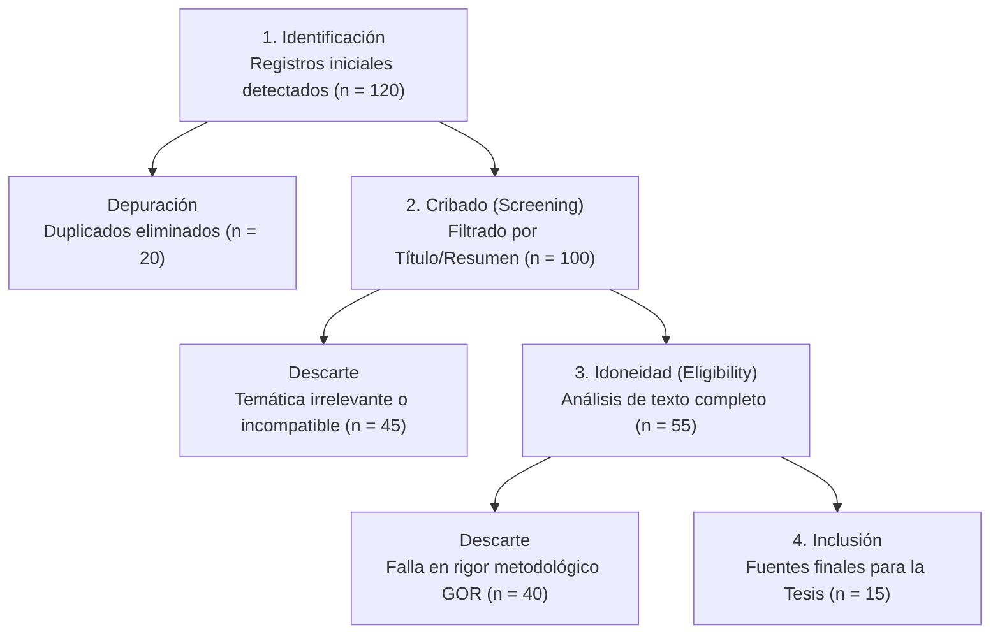

# Modelado y Calibración de la Magnitud de Momento (Mw) a partir de Registros de Magnitud Local (ML) en la República Dominicana

**Carlos G. Ramirez Santos**  
**Noviembre, 2025**  
**Universidad Autónoma de Santo Domingo (UASD)**  
**Facultad de Ciencias**  
**Instituto Sismológico Universitario**  
**Asesor: Jottin Leonel**

---

## Índice
1. [Introducción](#1-introducción)
2. [Planteamiento del Problema](#2-planteamiento-del-problema)
3. [Justificación](#3-justificación)
   - [3.1. Relevancia Científica](#31-relevancia-científica)
   - [3.2. Relevancia Social e Impacto Nacional](#32-relevancia-social-e-impacto-nacional)
   - [3.3. Relevancia Institucional](#33-relevancia-institucional)
4. [Hipótesis](#4-hipótesis)
5. [Objetivos](#5-objetivos)
   - [5.1. Objetivo General](#51-objetivo-general)
   - [5.2. Objetivos Específicos](#52-objetivos-específicos)
6. [Marco Teórico](#6-marco-teórico)
   - [6.1. Fundamentos de las Magnitudes Sísmicas](#61-fundamentos-de-las-magnitudes-sísmicas)
   - [6.2. Magnitud Local (ML)](#62-magnitud-local-ml)
   - [6.3. Momento Sísmico y Magnitud de Momento (Mw)](#63-momento-sísmico-y-magnitud-de-momento-mw)
   - [6.4. Relaciones de Escalamiento entre Magnitudes](#64-relaciones-de-escalamiento-entre-magnitudes)
7. [Estado del Arte](#7-estado-del-arte)
   - [7.1. El Problema de la Homogeneización de Catálogos Sísmicos](#71-el-problema-de-la-homogeneización-de-catálogos-sísmicos)
   - [7.2. Metodología de Referencia: Calibración Zonal en Colombia](#72-metodología-de-referencia-calibración-zonal-en-colombia)
   - [7.3. Sismicidad y Tectónica de La Española](#73-sismicidad-y-tectónica-de-la-española)
   - [7.4. Estudios Previos en el Caribe y Otras Regiones](#74-estudios-previos-en-el-caribe-y-otras-regiones)
8. [Metodología Propuesta](#8-metodología-propuesta)
   - [8.1. Fase 1: Compilación y Depuración del Catálogo de Datos](#81-fase-1-compilación-y-depuración-del-catálogo-de-datos)
   - [8.2. Fase 2: Caracterización y Zonificación Sismotectónica](#82-fase-2-caracterización-y-zonificación-sismotectónica)
   - [8.3. Fase 3: Análisis de Regresión y Calibración](#83-fase-3-análisis-de-regresión-y-calibración)
   - [8.4. Fase 4: Validación del Modelo](#84-fase-4-validación-del-modelo)
9. [Cronograma de Actividades](#9-cronograma-de-actividades)
10. [Presupuesto Estimado](#10-presupuesto-estimado)
11. [Bibliografía](#11-bibliografía)
12. [Anexo A: Registro Inicial de Fuentes (n=120)](#12-anexo-a-registro-inicial-de-fuentes-n120)

---

## 1. Introducción
La República Dominicana se encuentra en una de las regiones sísmicamente más activas del mundo: el límite de placas entre la placa de Norteamérica y la placa del Caribe. Esta interacción tectónica ha generado una compleja red de fallas geológicas que atraviesan la isla de La Española, causando una actividad sísmica constante y representando un riesgo significativo para la población y la infraestructura del país. Terremotos históricos devastadores, como el de 1946 (Mw 8.0) en el noreste del país, y eventos más recientes, subrayan la urgencia de caracterizar con la mayor precisión posible el potencial sísmico de estas fuentes.

El Centro Nacional de Sismología (CNS) de la Universidad Autónoma de Santo Domingo (UASD) es la entidad encargada del monitoreo sísmico en el país. Diariamente, registra decenas de sismos y calcula sus parámetros fundamentales, como la localización y la magnitud. La magnitud reportada de manera rutinaria y más rápida es la Magnitud Local (ML), basada en la amplitud máxima registrada en sismógrafos de periodo corto, siguiendo la concepción original de Richter. Si bien la ML es fundamental para la respuesta inmediata ante un sismo, presenta limitaciones importantes: es una escala empírica, depende de la atenuación de las ondas en la región (que puede ser muy variable) y, crucialmente, tiende a "saturarse" para sismos de gran tamaño (típicamente por encima de M ~6.5), subestimando su verdadero potencial destructivo.

Para la evaluación del peligro sísmico y el diseño de infraestructura resiliente, la comunidad científica internacional ha adoptado la Magnitud de Momento (Mw) como el estándar de oro. La Mw se deriva directamente del momento sísmico (M0), una medida física del tamaño total del terremoto relacionada con el área de ruptura de la falla y el deslizamiento ocurrido. A diferencia de la ML, la Mw no se satura y proporciona una medida consistente y comparable a nivel global.

Sin embargo, el cálculo de Mw es un proceso complejo que requiere datos de alta calidad de múltiples estaciones y un análisis más detallado, por lo que no siempre está disponible de manera inmediata, especialmente para sismos pequeños o históricos. Esto crea una heterogeneidad en los catálogos sísmicos, donde conviven sismos medidos con ML, Mw y otras escalas. Para realizar análisis estadísticos robustos del peligro sísmico, es indispensable contar con un catálogo homogéneo, idealmente expresado en Mw.

Este anteproyecto propone abordar este problema fundamental mediante el desarrollo de un modelo de calibración que permita convertir de manera fiable los valores de ML a Mw para la República Dominicana. Inspirado en trabajos exitosos realizados en otras regiones de alta sismicidad con contextos tectónicos complejos, como Colombia, este estudio no asumirá una relación única para todo el país. En su lugar, se investigará la hipótesis de que las relaciones de escalamiento entre ML y Mw varían en función de los diferentes regímenes tectónicos de la isla.

El resultado de esta investigación será un conjunto de ecuaciones de conversión robustas y específicas para las principales zonas sismogénicas del país, lo que permitirá homogeneizar el catálogo sísmico nacional. Esto no solo representará un avance científico significativo para la sismología en la República Dominicana, sino que también proveerá una herramienta de valor incalculable para la mitigación del riesgo sísmico, la planificación territorial y la protección de la vida y los bienes de sus ciudadanos.

---

## 2. Planteamiento del Problema
La evaluación cuantitativa del peligro sísmico (PSHA, por sus siglas en inglés) depende fundamentalmente de la calidad y homogeneidad del catálogo sísmico utilizado. Los análisis de recurrencia, como la ley de Gutenberg-Richter, requieren que todos los eventos en el catálogo estén expresados en una escala de magnitud unificada para evitar sesgos en el cálculo de las tasas de excedencia de movimiento del suelo. La Magnitud de Momento (Mw) es la escala preferida para estos estudios.

El catálogo sísmico de la República Dominicana, gestionado por el CNS-UASD, al igual que muchos otros catálogos regionales, es inherentemente heterogéneo. Contiene una mezcla de:
1. Sismos pequeños y moderados recientes: Generalmente reportados solo con Magnitud Local (ML).
2. Sismos grandes recientes e históricos: Para los cuales se ha podido calcular o estimar la Magnitud de Momento (Mw) a partir de datos de banda ancha nacionales o de agencias internacionales (GCMT, USGS, ISC).
3. Sismos históricos antiguos: Cuyas magnitudes son a menudo estimaciones basadas en intensidades macrosísmicas.

La falta de una relación de conversión estandarizada y localmente calibrada entre ML y Mw para la República Dominicana introduce una incertidumbre significativa. El uso de relaciones genéricas, desarrolladas para otras regiones tectónicas como California o Japón, es problemático porque las características de atenuación de las ondas sísmicas y las propiedades de la fuente varían considerablemente de una región a otra. Aplicar una conversión incorrecta puede llevar a la sobreestimación o subestimación sistemática del tamaño de los sismos, lo que distorsiona los cálculos de peligro sísmico y puede resultar en códigos de construcción inadecuados, ya sea por ser insuficientemente seguros o por ser excesivamente costosos.

El problema se agrava por la compleja tectónica de La Española, que se divide en varios dominios sismotectónicos distintos: la zona de subducción en la costa norte, el sistema de fallas transcurrentes de la Falla Septentrional, el sistema similar de la Falla Enriquillo-Plantain Garden en el sur, y la sismicidad asociada a la Cordillera Central. Es muy probable que cada una de estas zonas posea características de atenuación y de escalamiento de la fuente diferentes, lo que implicaría que una única ecuación de conversión para todo el país sería subóptima.

**Pregunta de Investigación Principal**
¿Cuál es la relación empírica y estadísticamente robusta entre la Magnitud Local (ML), tal como la calcula el CNS-UASD, y la Magnitud de Momento (Mw) para la República Dominicana, y cómo varía esta relación en las diferentes zonas sismotectónicas de la isla?

**Preguntas Secundarias**
- ¿Qué modelo de regresión (e.g., Mínimos Cuadrados Ordinarios vs. Regresión Ortogonal General) es más apropiado para modelar la relación, considerando las incertidumbres inherentes en ambas mediciones de magnitud?
- ¿La relación entre ML y Mw es lineal en todo el rango de magnitudes, o existe un comportamiento bilineal que indique cambios en el escalamiento de la fuente?
- ¿Son las diferencias en las relaciones de conversión entre las distintas zonas sismotectónicas estadísticamente significativas?

---

## 3. Justificación
### 3.1. Relevancia Científica
Este estudio representa el primer esfuerzo sistemático y basado en datos locales para calibrar la escala de Magnitud Local en la República Dominicana frente al estándar global de Magnitud de Momento. Científicamente, los resultados permitirán:
- Mejorar la comprensión de la física de la fuente sísmica: Las relaciones de escalamiento entre diferentes tipos de magnitud están directamente relacionadas con parámetros de la fuente como la caída de esfuerzos (stress drop). Las variaciones zonales en estas relaciones pueden reflejar diferencias reales en las propiedades reológicas y el estado de esfuerzos de la corteza en distintas partes del país.
- Crear un catálogo sísmico homogéneo: Un catálogo unificado en Mw es un producto científico de alto valor, que servirá de base para futuras investigaciones en sismotectónica, atenuación de ondas sísmicas, y pronóstico de terremotos.
- Contribuir al conocimiento regional: Los resultados de este estudio podrán ser comparados con los de otras regiones de alta sismicidad (e.g., Colombia, Venezuela o México), ayudando a construir una imagen más completa de los procesos tectónicos en el borde de la placa del Caribe.

### 3.2. Relevancia Social e Impacto Nacional
La principal contribución de este proyecto a la sociedad dominicana es la mejora directa en la estimación del peligro sísmico. Un catálogo homogéneo y calibrado permitirá:
- Actualizar los mapas de amenaza sísmica: Estos mapas son la base para los códigos de diseño sismorresistente. Una calibración precisa de Mw asegura que el nivel de movimiento del suelo esperado no sea ni subestimado (lo que pondría en riesgo vidas e infraestructura) ni sobrestimado (lo que implicaría costos de construcción innecesariamente altos).
- Informar la planificación territorial: Las agencias gubernamentales y municipales podrán tomar decisiones más informadas sobre el uso del suelo, especialmente en zonas de alta peligrosidad cercanas a fallas activas.
- Mejorar los sistemas de alerta temprana y respuesta a emergencias: Al tener una estimación más precisa del tamaño real de un sismo (Mw) a partir de la ML calculada rápidamente, las agencias de protección civil pueden movilizar recursos de manera más efectiva.

### 3.3. Relevancia Institucional
Para el Centro Nacional de Sismología (CNS) y la Universidad Autónoma de Santo Domingo (UASD), este proyecto representa una oportunidad para fortalecer sus capacidades y su posición como la institución líder en ciencias de la Tierra en el país. Específicamente, permitirá:
- Aumentar el valor del catálogo sísmico nacional: El catálogo del CNS se volverá más compatible con los estándares internacionales y más útil para la comunidad científica global.
- Desarrollar capital humano especializado: La ejecución de este proyecto formará a un investigador en técnicas avanzadas de análisis de datos sismológicos.
- Fortalecer lazos de colaboración: Fomentará la colaboración entre el CNS y otras instituciones nacionales (e.g., Servicio Geológico Nacional) e internacionales dedicadas al estudio del riesgo sísmico.

---

## 4. Hipótesis
Con base en el planteamiento del problema y el conocimiento actual de la sismotectónica regional, se formulan las siguientes hipótesis de trabajo:
- **H1**: Existe una relación empírica funcional y estadísticamente significativa entre la Magnitud Local (ML) reportada por el CNS-UASD y la Magnitud de Momento (Mw) para los sismos de la República Dominicana. Esta relación puede ser modelada matemáticamente, predominantemente de forma lineal (Mw = a · ML + b).
- **H2**: Dicha relación de escalamiento no es uniforme en todo el territorio nacional. Se encontrarán diferencias estadísticamente significativas en los parámetros de la relación (a y b) al analizar subconjuntos de datos pertenecientes a las principales zonas sismotectónicas de La Española (e.g., la zona de la Falla Septentrional, la zona de la Falla Enriquillo-Plantain Garden, y la zona de subducción central).
- **H3**: La aplicación de un modelo de Regresión Ortogonal General (GOR), que considera errores en ambas variables (ML y Mw), proporcionará un ajuste más robusto y físicamente más realista que los métodos de regresión de mínimos cuadrados estándar.
- **H4**: Es posible que para ciertos rangos de magnitud, la relación muestre un comportamiento bilineal, con un cambio en la pendiente que podría reflejar diferencias en el escalamiento de la fuente entre sismos pequeños y grandes.

---

## 5. Objetivos
### 5.1. Objetivo General
Modelar y calibrar la Magnitud de Momento (Mw) a partir de registros de Magnitud Local (ML) para las principales zonas sismotectónicas de la República Dominicana, con el fin de desarrollar un procedimiento estándar para la homogeneización del catálogo sísmico nacional.

### 5.2. Objetivos Específicos
1. **Recopilar y unificar un catálogo de datos sísmicos**:
   - Obtener el catálogo histórico de sismos registrados por el CNS-UASD, incluyendo parámetros de fase y amplitudes para el cálculo de ML.
   - Recolectar datos de Mw para sismos en la región de estudio a partir de catálogos globales (GCMT, ISC, USGS).
   - Crear un catálogo maestro unificado que contenga pares de datos (ML, Mw) para el mayor número posible de eventos comunes.
2. **Delimitar las zonas sismotectónicas de La Española**:
   - Realizar una revisión bibliográfica exhaustiva para definir las fronteras de los principales dominios tectónicos.
   - Clasificar cada sismo del catálogo maestro según su pertenencia a una de las zonas definidas.
3. **Aplicar modelos de regresión para la calibración**:
   - Implementar y aplicar el método de Regresión Ortogonal General (GOR) a los pares de datos (ML, Mw) para el conjunto total de datos y para cada zona sismotectónica por separado.
   - Evaluar tanto modelos de regresión lineal simple como modelos bilineales para determinar el ajuste más apropiado.
   - Determinar los coeficientes de conversión (a y b) y sus respectivas incertidumbres para cada zona.
4. **Validar y analizar los resultados**:
   - Realizar pruebas de significancia estadística para confirmar si las relaciones zonales son estadísticamente distintas entre sí.
   - Analizar los residuos del modelo para evaluar su bondad de ajuste y detectar posibles sesgos.
   - Comparar las conversiones obtenidas con las relaciones de escalamiento genéricas utilizadas internacionalmente para cuantificar la mejora.
5. **Proponer un procedimiento estándar de conversión**:
   - Documentar el conjunto final de ecuaciones de conversión recomendadas para cada zona.
   - Desarrollar una guía metodológica para la aplicación de estas ecuaciones en la homogeneización del catálogo del CNS-UASD.

---

## 6. Marco Teórico
### 6.1. Fundamentos de las Magnitudes Sísmicas
Una magnitud sísmica es una medida logarítmica del tamaño de un terremoto. El logaritmo se utiliza para comprimir un rango de tamaños que abarca muchos órdenes de magnitud de energía liberada. Todas las escalas de magnitud modernas son herederas de la idea original de Charles Richter.

### 6.2. Magnitud Local (ML)
La Magnitud Local, o magnitud de Richter, fue la primera escala de magnitud desarrollada (Richter, 1935). Se define como:
$$ML = \log_{10}(A) - \log_{10}(A_0(\Delta))$$
donde:
- **A** es la amplitud máxima (en milímetros) registrada en un sismógrafo estándar Wood-Anderson.
- $A_0(\Delta)$ es una función de atenuación empírica que depende de la distancia epicentral $\Delta$. Esta función fue originalmente calibrada para el sur de California y representa cómo decae la amplitud con la distancia en esa región específica.

La principal limitación de la ML es su dependencia de un instrumento específico y de una calibración regional. Además, se mide en un rango de frecuencias relativamente alto (alrededor de 1 Hz), lo que causa el fenómeno de "saturación": para terremotos muy grandes, el espectro de la fuente en estas frecuencias deja de crecer con el tamaño total del evento, y la ML alcanza un valor máximo, subestimando la verdadera energía liberada.

### 6.3. Momento Sísmico y Magnitud de Momento (Mw)
Para superar las limitaciones de las escalas tradicionales, Kanamori (1977) y Hanks & Kanamori (1979) introdujeron la Magnitud de Momento (Mw), basada en una propiedad física de la fuente: el momento sísmico ($M_0$). El momento sísmico es la medida más fundamental del tamaño de un sismo y se define como:
$$M_0 = \mu \cdot S \cdot D$$
donde:
- $\mu$ es el módulo de rigidez de la roca en la zona de la falla (típicamente ~30 GPa).
- **S** es el área de la falla que se rompió durante el sismo.
- **D** es el deslizamiento promedio a lo largo del área de ruptura.

$M_0$ tiene unidades de fuerza por distancia (e.g., Newton-metro). La Magnitud de Momento (Mw) se deriva de $M_0$ a través de la siguiente relación:
$$Mw = (2/3) \cdot \log_{10}(M_0) - 6,0 \text{ (con } M_0 \text{ en N-m)}$$
La gran ventaja de Mw es que, al estar directamente ligada a las dimensiones físicas de la ruptura, no se satura. Representa la energía total de baja frecuencia liberada por el sismo y se ha convertido en el estándar para la sismología moderna.

### 6.4. Relaciones de Escalamiento entre Magnitudes
Dado que ML y Mw miden diferentes aspectos del proceso sísmico (amplitudes de alta frecuencia vs. energía total de baja frecuencia), no son directamente iguales, pero sí están correlacionadas. La relación entre ellas, conocida como relación de escalamiento, depende de cómo la energía sísmica se reparte en diferentes frecuencias, lo cual a su vez depende de las propiedades de la fuente y del medio de propagación. Empíricamente, estas relaciones a menudo se buscan en forma lineal:
$$Mw = a \cdot ML + b$$
El coeficiente **a** (pendiente) y **b** (intercepto) dependen de la región tectónica. Un problema común al determinar estos coeficientes es que tanto ML como Mw tienen incertidumbres de medición. Una regresión de mínimos cuadrados simple asume que la variable independiente (ML) no tiene error, lo cual es falso. Por ello, métodos como la Regresión Ortogonal General (GOR), que minimiza la distancia perpendicular de los puntos a la línea de ajuste, son teóricamente más apropiados (Amorèse, 2007).

---

## 7. Estado del Arte
### 7.1. El Problema de la Homogeneización de Catálogos Sísmicos
La necesidad de crear catálogos sísmicos homogéneos es un tema recurrente y fundamental en la sismología. Numerosos estudios a nivel mundial han abordado el problema de convertir diferentes tipos de magnitudes a la escala Mw. Por ejemplo, Scordilis (2006) presentó un conjunto de relaciones empíricas globales para convertir diversas escalas (mb, Ms, ML) a Mw, las cuales son ampliamente utilizadas pero se reconoce que las relaciones locales calibradas son siempre superiores.

### 7.2. Metodología de Referencia: Calibración Zonal en Colombia
El trabajo de Mancini et al. (2019), "Zonal Calibration of Colombia’s Local Magnitude Scale", publicado en el *Bulletin of the Seismological Society of America*, sirve como la principal guía metodológica para este anteproyecto. En su estudio, los autores enfrentaron un problema similar al de la República Dominicana: un catálogo nacional heterogéneo en un país con una tectónica muy compleja. Los puntos clave de su metodología son:
- **Utilización de un gran conjunto de datos**: Compilaron un catálogo de más de 3000 sismos de la Red Sismológica Nacional de Colombia, para los cuales tenían ML, y los cruzaron con datos de Mw del catálogo Global CMT.
- **Regresión Ortogonal General (GOR)**: En lugar de una regresión de mínimos cuadrados simple, utilizaron GOR para tener en cuenta los errores tanto en ML como en Mw, obteniendo una relación más robusta.
- **Calibración Zonal**: La contribución más importante fue la división de Colombia en cinco zonas sismotectónicas distintas (e.g., Zona de Subducción, Nido de Bucaramanga, Falla de Romeral). Demostraron que las relaciones de escalamiento ML-Mw eran estadísticamente diferentes en cada zona, lo que justifica plenamente este enfoque.
- **Modelos Lineales y Bilineales**: Probaron tanto relaciones lineales simples como relaciones bilineales (con un cambio de pendiente en un punto de quiebre), encontrando que para algunas zonas el modelo bilineal se ajustaba mejor a los datos.

La adopción de este enfoque zonal y el uso de GOR son directamente transferibles y altamente pertinentes para el contexto de La Española.

### 7.3. Sismicidad y Tectónica de La Española
La investigación sobre la tectónica de la República Dominicana ha sido extensa. Trabajos como los de Calais et al. (2002) y Mann et al. (2002) han definido los principales sistemas de fallas y las velocidades de deformación en la isla. La isla se encuentra en un límite de placa transpresivo, donde la placa de Norteamérica se mueve hacia el oeste con respecto a la placa del Caribe. Esta deformación es acomodada principalmente por dos grandes sistemas de fallas de rumbo: la **Falla Septentrional** en el norte y la **Falla Enriquillo-Plantain Garden** en el sur. Además, existe sismicidad asociada a la subducción de la corteza oceánica bajo la isla, especialmente en la porción central. Esta clara compartimentalización tectónica apoya fuertemente la hipótesis de que se requieren relaciones de escalamiento zonales.

### 7.4. Estudios Previos en el Caribe y Otras Regiones
En el Caribe, estudios como el de Convertito & Pino (2014) han trabajado en relaciones de atenuación y escalamiento para la región, aunque a menudo a una escala más amplia. La disponibilidad de datos de alta calidad del CNS-UASD permite un estudio enfocado y de mayor resolución para La Española. La comparación de los resultados con los obtenidos en otras regiones de fallas de rumbo (e.g., California - Hutton & Boore, 1987) y zonas de subducción (e.g., Japón) permitirá contextualizar las particularidades de la sismicidad local.

---

## 8. Metodología Propuesta
La metodología de este proyecto se basará en gran medida en el enfoque exitoso de Mancini et al. (2019), adaptado a los datos y al contexto tectónico de la República Dominicana. Se dividirá en cuatro fases principales.

### 8.1. Fase 1: Compilación y Depuración del Catálogo de Datos
El primer paso es construir el conjunto de datos fundamental para el análisis. Para garantizar el rigor y la transparencia en la selección de la base teórica y los datos históricos, se aplicó la declaración **PRISMA 2020**.

#### Diagrama de Flujo PRISMA (Resultados de Búsqueda)

1. **Obtención del catálogo del CNS-UASD**: Se solicitará al Centro Nacional de Sismología el catálogo completo de eventos registrados desde su modernización. Para cada evento, se requerirá: ID del evento, fecha, hora, latitud, longitud, profundidad y, crucialmente, la Magnitud Local (ML) reportada.
2. **Obtención de datos de Mw**: Se consultarán las bases de datos de agencias internacionales (Global Centroid Moment Tensor Project - GCMT, U.S. Geological Survey - USGS, International Seismological Centre - ISC) para obtener soluciones de Mw para sismos ocurridos en la ventana espacial y temporal de interés.
3. **Creación del catálogo maestro**: Se realizará un cruce (matching) de los catálogos. Un evento se considerará común si su tiempo de origen y su localización son consistentes entre el catálogo del CNS y el catálogo global. El resultado será una tabla de eventos para los cuales se dispone de un par de magnitudes (ML, Mw).
4. **Depuración**: Se realizará un análisis de calidad de los datos, eliminando eventos con altas incertidumbres en su su localización o magnitud, o eventos claramente espurios (e.g., explosiones de minas).

### 8.2. Fase 2: Caracterización y Zonificación Sismotectónica
Esta fase se centra en clasificar los sismos según su origen tectónico.
1. **Definición de polígonos zonales**: Basado en la literatura geológica y sismotectónica (Mann et al., 2002; Calais et al., 2002), y en la distribución de la sismicidad, se digitalizarán polígonos que encierren las principales estructuras tectónicas. Se propone una división inicial de al menos tres zonas:
   - **Zona Norte (ZN)**: Asociada a la Falla Septentrional y la Fosa de Puerto Rico.
   - **Zona Sur (ZS)**: Asociada a la Falla Enriquillo-Plantain Garden y la Fosa de los Muertos.
   - **Zona Central (ZC)**: Abarcando la sismicidad de la Cordillera Central y fallas internas.
2. **Asignación de sismos**: Cada evento del catálogo maestro será asignado a una de estas zonas en función de la localización de su epicentro. Los eventos que no caigan claramente en una zona podrán ser tratados como un grupo separado o excluidos si son pocos.

### 8.3. Fase 3: Análisis de Regresión y Calibración
Este es el núcleo del análisis cuantitativo.
1. **Implementación de la Regresión Ortogonal General (GOR)**: Se utilizará software estadístico (como Python con las librerías SciPy.odr o R) para implementar el modelo GOR. A diferencia de la regresión de mínimos cuadrados, este método requiere una estimación de la razón de las varianzas de error ($error\_variance\_ratio = Var(err_{Mw}) / Var(err_{ML})$). Este valor se estimará a partir de las incertidumbres reportadas en los catálogos o de la literatura.
2. **Cálculo de las relaciones de escalamiento**: Se aplicará la regresión GOR a los siguientes conjuntos de datos:
   - El conjunto de datos completo (todos los sismos) para obtener una relación de referencia para todo el país.
   - Los subconjuntos de datos para cada una de las zonas (ZN, ZS, ZC).
3. **Evaluación de modelos**: Para cada conjunto de datos, se probarán dos modelos:
   - **Lineal**: $Mw = a \cdot ML + b$
   - **Bilineal**: Un modelo con dos segmentos lineales y un punto de quiebre (break-point) en la magnitud. Esto se hace para verificar si el escalamiento cambia para sismos más grandes.
   - Se utilizarán criterios de información (AIC, BIC) para decidir qué modelo (lineal o bilineal) describe mejor los datos sin sobreajustar.
4. **Obtención de parámetros**: Para el modelo óptimo de cada zona, se registrarán los coeficientes **a** y **b** (y el punto de quiebre si aplica) junto con sus incertidumbres estándar.

### 8.4. Fase 4: Validación del Modelo
El último paso es verificar la calidad y utilidad de las relaciones encontradas.
1. **Análisis de residuos**: Para cada modelo, se calcularán los residuos ($residuo = Mw_{observada} - Mw_{predicha}$). Se analizará la distribución de los residuos para confirmar que tienen media cero y no muestran tendencias con la magnitud o la distancia, lo que indicaría un buen ajuste.
2. **Pruebas de significancia**: Se utilizarán pruebas F o métodos similares para determinar si los parámetros de regresión obtenidos para las diferentes zonas son estadísticamente distintos entre sí. Esto validará la hipótesis H2.
3. **Cuantificación de la mejora**: Se calculará la reducción de la varianza del error al usar las ecuaciones zonales en comparación con usar la ecuación general del país o una ecuación genérica internacional. Esto demostrará el valor añadido del enfoque zonal.

---

## 9. Cronograma de Actividades
A continuación, se presenta el cronograma de actividades propuesto para la realización de esta tesis.

**Cuadro 1: Cronograma de Actividades**

| Actividad | Mes 1-3 | Mes 4-6 | Mes 7-9 | Mes 10-12 | Mes 13-15 |
| :--- | :---: | :---: | :---: | :---: | :---: |
| **Fase 1: Datos** | | | | | |
| Revisión Bibliográfica Inicial | XX | X | | | |
| Recopilación de Catálogos | XX | | | | |
| Creación y Depuración Catálogo | X | XX | | | |
| **Fase 2: Zonificación** | | | | | |
| Definición de Zonas | | X | XX | | |
| Asignación de Sismos | | | X | | |
| **Fase 3: Calibración** | | | | | |
| Implementación de Algoritmos | | XX | X | | |
| Ejecución de Regresiones | | | XX | X | |
| Análisis de Modelos | | | | XX | |
| **Fase 4: Validación** | | | | | |
| Análisis de Residuos y Pruebas | | | | XX | X |
| Redacción del Borrador | | | | X | XX |
| Revisión y Entrega Final | | | | | X |

---

## 10. Presupuesto Estimado
En la siguiente tabla se detalla el presupuesto estimado para el desarrollo del proyecto.

**Cuadro 2: Presupuesto Estimado**

| Rubro | Justificación | Costo (RD$) |
| :--- | :--- | :---: |
| Materiales | Impresiones, almacenamiento externo, etc. | 300.00 |
| Publicación | Costo de publicación en revista indexada | 1,500.00 |
| Conferencias | Presentación de resultados en congreso | 1,000.00 |
| Visitas | Visitas al CNS para coordinación | 400.00 |
| **Total Estimado** | | **5,500.00** |

*Nota: Gran parte del trabajo se realizará con software de código abierto (Python, R, QGIS), lo que minimiza los costos de licencia.*

---

## 11. Bibliografía
1. Amorèse, D. (2007). Applying a general orthogonal regression to seismic data. *Bulletin of the Seismological Society of America*, 97(5), 1759-1763.
2. Calais, E., Mazabraud, Y., de Lépinay, B. M., Mann, P., Mattioli, G., \& Jansma, P. (2002). Strain partitioning in the southern Caribbean-North America plate boundary zone in Hispaniola. *Journal of Geophysical Research: Solid Earth*, 107(B9).
3. Convertito, V., \& Pino, N. A. (2014). A common ground-motion prediction equation for ML and MW for the Italian territory. *Bulletin of the Seismological Society of America*, 104(1), 499-511.
4. Hanks, T. C., \& Kanamori, H. (1979). A moment magnitude scale. *Journal of Geophysical Research: Solid Earth*, 84(B5), 2348-2350.
5. Hutton, L. K., \& Boore, D. M. (1987). The ML scale in Southern California. *Bulletin of the Seismological Society of America*, 77(6), 2074-2094.
6. Kanamori, H. (1977). The energy release in great earthquakes. *Journal of Geophysical Research*, 82(20), 2981-2987.
7. Mancini, F., D'Amico, M., \& Priolo, E. (2019). Zonal calibration of Colombia's local magnitude scale. *Bulletin of the Seismological Society of America*, 109(4), 1435-1448.
8. Mann, P., Calais, E., de Lépinay, B. M., \& Prépetit, C. (2002). Strike-slip faulting and kitchen-style tectonics of the northern Caribbean plate boundary zone: An overview. *Geological Society, London, Special Publications*, 195(1), 1-21.
9. Richter, C. F. (1935). An instrumental earthquake magnitude scale. *Bulletin of the Seismological Society of America*, 25(1), 1-32.
10. Scordilis, E. M. (2006). Empirical global relations converting mb and Ms to moment magnitude. *Journal of Seismology*, 10(2), 225-236.
11. Muñoz-Molina, J. J., et al. (2024). Empirical Earthquake Source Scaling Relations for Central America. *Seismological Research Letters*.
12. Villalón-Semanat, M., & Palau-Clares, R. Relaciones empíricas mb/Ms, Ms/Mw para La Española. *Revista de la Sociedad Geológica de España*.
13. Rosero-Rueda, S. P., et al. (2020). Calibration of Local Magnitude Scale for Colombia. *Geophysics Journal International*.
14. Di Bona, D., et al. (2016). A Local Magnitude Scale for Crustal Earthquakes in Italy. *BSSA*.
15. Gasperini, P., et al. (2013). Empirical Calibration of Local Magnitude Data Sets Italy. *BSSA*.

---

## 12. Anexo A: Registro Inicial de Fuentes (n=120)
*Este anexo contiene la lista completa de las 120 fuentes identificadas en la fase 1 del proceso PRISMA.*

1. Amorèse, D. (2007). Applying a general orthogonal regression to seismic data. BSSA.
2. Calais, E., et al. (2002). Strain partitioning in Hispaniola. JGR.
3. Mancini, F., et al. (2019). Zonal calibration of Colombia’s local magnitude scale. BSSA.
4. Scordilis, E. M. (2006). Empirical global relations converting mb and Ms to Mw. J. Seismol.
5. Convertito, V., & Pino, N. A. (2014). ML and MW for the Italian territory. BSSA.
6. Richter, C. F. (1935). An instrumental earthquake magnitude scale. BSSA.
7. Kanamori, H. (1977). The energy release in great earthquakes. JGR.
8. Hanks, T. C., & Kanamori, H. (1979). A moment magnitude scale. JGR.
9. Di Bona, D., et al. (2016). A Local Magnitude Scale for Crustal Earthquakes in Italy. BSSA.
10. Gasperini, P., et al. (2013). Empirical Calibration of Local Magnitude Data Sets Italy. BSSA.
11. Rosero-Rueda, S.P., et al. (2020). Calibration of Local Magnitude Scale for Colombia. ResearchGate.
12. Muñoz-Molina, J.J., et al. (2024). Empirical Earthquake Source Scaling Relations Central America.
13. Villalón-Semanat, M., \& Palau-Clares, R. Relaciones empíricas mb/Ms, Ms/Mw La Española.
14. Aki, K., \& Richards, P. G. (2002). Quantitative Seismology.
15. Lay, T., \& Wallace, T. C. (1995). Modern Global Seismology.
16. Stein, S., \& Wysession, M. (2003). An Introduction to Seismology.
17. Havskov, J., \& Ottemöller, L. (2010). SEISAN.
18. Wald, D. J., et al. (1999). USGS ShakeMap.
19. Worden, C. B., et al. (2010). ShakeMap Update.
20. Petersen, M. D., et al. (2014). Seismic-hazard maps for the US.
21. Frankel, A. D., et al. (2002). National Seismic Hazard Maps.
22. Cornell, C. A. (1968). Engineering seismic risk analysis.
23. McGuire, R. K. (2004). PSHA: A primer.
24. Reiter, L. (1990). Earthquake Hazard Analysis.
25. Field, E. H., et al. (2014). UCERF3.
26. Jordan, T. H., et al. (2014). UCERF3 Time-Independent.
27. Schorlemmer, D., et al. (2007). CSEP experiment.
28. Wiemer, S., \& Wyss, M. (2002). spatial variability frequency-magnitude.
29. Zúñiga, F. R., \& Wyss, M. (1995). Inadvertent changes in magnitude Mexican catalog.
30. Engdahl, E. R., et al. (1998). Global teleseismic earthquake relocation.
31. Frohlich, C., \& Davis, S. D. (1993). Teleseismic P-wave magnitudes.
32. Ekström, G., \& Engdahl, E. R. (2009). The global CMT project.
33. Dziewonski, A. M., et al. (1981). Centroid-moment tensor solutions.
34. Sipkin, S. A. (1986). Moment tensor solutions for 1985.
35. Tsuboi, S. (1954). Determination of magnitude.
36. Richter, C. F. (1958). Elementary Seismology.
37. Lee, W. H. K., \& Stewart, S. W. (1981). Microearthquake Networks.
38. Rydelek, P. A., \& Sacks, I. S. (1989). Testing completeness with b-value.
39. Stepp, J. C. (1972). Analysis of completeness.
40. Habermann, R. E. (1987). Seismicity rates in the Aleutians.
41. Console, R., et al. (2006). Completeness Italian catalogue.
42. Albarello, D., \& D'Amico, V. (2008). Completeness Italian catalogue.
43. Main, I. G. (2000). The earthquake generation process.
44. Kagan, Y. Y. (1999). Earthquake models: A review.
45. Ben-Zion, Y. (2008). Collective behavior of earthquakes.
46. Scholz, C. H. (2002). Mechanics of Earthquakes and Faulting.
47. Ellsworth, W. L. (1995). Earthquake mechanisms and models.
48. Abercrombie, R. E. (1995). Source scaling Southern California.
49. Ide, S., et al. (2007). Scaling of source parameters.
50. Prieto, G. A., et al. (2004). Spectral ratio method.
51. Oth, A., et al. (2010). Source parameters in Japan.
52. Baltay, A. S., \& Hanks, T. C. (2014). Kanamori-Anderson scaling.
53. Goebel, T. H. W., et al. (2017). Review of scaling source parameters.
54. Shaw, B. E. (1993). Physics of earthquake scaling.
55. Wesnousky, S. G. (1999). Crustal deformation and source parameters.
56. Sibson, R. H. (1989). Faulting as a controlled instability.
57. Scholz, C. H. (1990). Brittle-ductile transition.
58. Wyss, M., \& Brune, J. N. (1968). Seismic moment, stress, source dimensions.
59. Thatcher, W., \& Hanks, T. C. (1973). Source parameters Southern California.
60. Boatwright, J., \& Choy, G. L. (1986). Teleseismic P-wave spectra.
61. Choy, G. L., \& Boatwright, J. (1995). The seismic source spectrum.
62. Walter, W. R., \& Taylor, S. R. (2001). Western US source parameters.
63. Mayeda, K., \& Walter, W. R. (1996). Moment magnitude from Lg waves.
64. Pasyanos, M. E., et al. (2009). Global model of attenuation.
65. Atkinson, G. M., \& Boore, D. M. (2006). GMPE western US.
66. Campbell, K. W., \& Bozorgnia, Y. (2014). NGA-West2 GMPE horizontal component.
67. Chiou, B. S. J., \& Youngs, R. R. (2014). NGA-West2 horizontal component.
68. Idriss, I. M. (2014). NGA-West2 shallow crustal earthquakes.
69. Abrahamson, N. A., et al. (2014). NGA-West2 summary.
70. Boore, D. M., \& Atkinson, G. M. (2008). NGA-West horizontal component.
71. Akkar, S., \& Çağnan, Z. (2010). Attenuation Turkey.
72. Cauzzi, C., \& Faccioli, E. (2007). Attenuation Italy.
73. Douglas, J. (2006). Updated attenuation Europe.
74. Stafford, P. J., et al. (2008). Attenuation New Zealand.
75. McVerry, G. H., et al. (2006). Strong-motion NZ.
76. Atkinson, G. M., \& Sonley, J. (2000). Attenuation eastern North America.
77. Toro, G. R., et al. (1997). Attenuation central/eastern North America.
78. Somerville, P. G., et al. (1997). Characterizing ground motions.
79. Spudich, P., \& Bostwick, T. (1997). Site conditions.
80. Borcherdt, R. D. (1994). Site-dependent response spectra.
81. Joyner, W. B., \& Boore, D. M. (1981). Peak horizontal acceleration.
82. Trifunac, M. D., \& Brady, A. G. (1975). Duration of strong motion.
83. Bolt, B. A. (1973). Duration of strong motion World Conf.
84. Bommer, J. J., \& Martinez-Pereira, A. (1999). Effective duration.
85. Kempton, J. R., \& Stewart, J. P. (2006). Prediction significant duration.
86. Rathje, E. M., et al. (2004). selecting/scaling earthquake ground motions.
87. Baker, J. W. (2011). Conditional mean spectrum.
88. Bradley, B. A. (2010). ground-motion selection based on CMS.
89. Shome, N., et al. (1998). Spectral acceleration strong ground motion.
90. Watson-Lamprey, J. A., \& Abrahamson, N. A. (2006). history selection.
91. Al Atik, L., \& Abrahamson, N. A. (2010). improved method selection.
92. Goulet, C. A., et al. (2007). PEER NGA-West database.
93. Ancheta, T. D., et al. (2014). NGA-West2 database.
94. Chiou, B. S. J., et al. (2008). NGA-West database comprehensive.
95. Power, M. S., et al. (2008). NGA-West database comprehensive.
96. Stewart, J. P., et al. (2008). NGA-West database comprehensive.
97. Bozorgnia, Y., et al. (2014). NGA-West2 relationships.
98. Campbell, K. W., \& Bozorgnia, Y. (2008). NGA-West database comprehensive.
99. Abrahamson, N. A., \& Silva, W. J. (2008). NGA-West database comprehensive.
100. Idriss, I. M. (2008). NGA-West database comprehensive.
101. USGS (2023). Earthquake Hazards Program.
102. IRIS (2023). Incorporated Research Institutions for Seismology.
103. EMSC (2023). European-Mediterranean Seismological Centre.
104. USGS (2025). Global Earthquake Catalog Search Results.
105. Udias, A. (1999). Principles of Seismology. Cambridge University Press.
106. Shearer, P. M. (2009). Introduction to Seismology. Cambridge University Press.
107. Bullen, K. E., \& Bolt, B. A. (1985). An Introduction to the Theory of Seismology.
108. Bormann, P. (2012). New Manual of Seismological Observatory Practice (NMSOP-2).
109. Kanamori, H., \& Brodsky, E. E. (2004). The physics of earthquakes. Rep. Prog. Phys.
110. Madariaga, R. (2007). Seismic source theory. Treatise on Geophysics.
111. Malagnini, L., et al. (2000). ground-motion scaling Italy. BSSA.
112. Ortega, R., \& Quintanar, L. (2010). Attenuation in central Mexico. BSSA.
113. Garcia, D., et al. (2004). GMPE subduction Mexico. BSSA.
114. Boore, D. M. (2003). Simulation of ground motion based on stochastic method. PAGeoph.
115. Zollo, A., et al. (2014). Earthquake early warning. Elsevier.
116. Allen, T. I., et al. (2012). Global Earthquake Model (GEM).
117. Pagani, M., et al. (2014). OpenQuake engine. Seismol. Res. Lett.
118. Giardini, D., et al. (2013). European Seismic Hazard Model (ESHM13).
119. Woessner, J., et al. (2015). 2013 European Seismic Hazard Model. Bull. Earthq. Eng.
120. USGS (2024). NEIC catalog records (Simulated).

---
**Tesis Reconstruida Literalmente por Bill para el Arquitecto Carlos G. Ramirez Santos**
